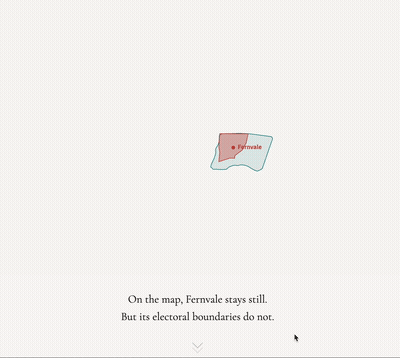

# Mapping electoral boundaries

Each time electoral boundaries are reviewed ahead of a general election in Singapore, we are reminded that there is a number of residents who can live in the same flat for years and still find themselves voting under a different constituency name every other election.

I wanted to know where residents feel this most, so I mapped how electoral boundaries have shifted across five general elections from 2006 to 2025, and compared those changes with where the opposition has contested. [Here](https://wongpeiting.github.io/electoral_boundaries/) is the resultant article.

### Project takeaways

This is one article that I had wanted to produce for some time now, if not for my tech limitations. Thankfully, the availability of AI tools has significantly lowered the technical barrier to working with spatial data. Using Claude Code, I was able to manipulate boundary files and track changes across multiple elections in ways that would previously have required far more specialised training. This shifted the nature of the challenge to how I can interpret what I am seeing rather than whether I could process the data. I could even make the data look more "fun" by playing around with **CSS animations. <-- I owe this knowledge to [Carson TerBush](https://github.com/carsonology), my Data Studio mentor. Many thanks to her for explaining what CSS animations can do.

Given that algorithms class is in full swing, the project also pushed me to think more carefully about how to communicate statistical findings. The analysis did not yield strong or significant relationships, largely due to small sample sizes, with only around 30 constituencies per election and fewer than a dozen WP-contested seats in most cycles, but that did not mean there was no story. The difficulty lay in showing how the absence of a clear statistical link could coexist with a meaningful spatial pattern and in expressing that insight without defaulting to technical language.

## Files

| File | Description |
|---|---|
| `index.html` | Main interactive page — scrollytelling blobs, two choropleth maps (via iframe embeds), dumbbell chart. |
| `maps/` | Pre-built SvelteKit static site (LayerCake Canvas+SVG+HTML layered maps). Source in `layercake-maps/` (gitignored). |
| `scroll_shapes_all.js` | SVG morph data for the 7 scrollytelling blob areas (generated by `extract_all_blobs.py`) |
| `analysis/extract_all_blobs.py` | Python script that extracts and reprojects boundary polygons into SVG blob paths for the scroll animation |
| `analysis/boundary_overlap_analysis.ipynb` | Core spatial analysis computing boundary change overlaps from 5 election shapefiles, produces `boundary_changes_final.geojson` (embedded in index.html as `boundaryData`) |
| `analysis/wp_contestation_analysis.ipynb` | WP contestation analysis. Results are hardcoded into the dumbbell chart and `wpLookup` in index.html |

## Data sources

Electoral boundary shapefiles for 2006, 2011, 2015, 2020, and 2025, which represent the official gazetted boundaries for the general elections in those years, were obtained from [Elections Department](https://data.gov.sg/datasets?agencies=Elections%20Department%20(ELD)).

## Methodology

### Spatial analysis

The electoral boundary data was treated with GIS spatial overlay to identify areas affected by boundary changes:

1. **Land mask normalisation:** All boundary files were clipped to the 2025 land boundary to exclude territorial waters, which were included in older files (particularly 2006) and would have distorted area calculations.
2. **Pairwise comparison:** Geometric boundary intersections were computed for each consecutive pair of elections (2006→2011, 2011→2015, 2015→2020, 2020→2025).
3. **Change detection:** An area was counted as "changed" only if it moved from one named constituency (GRC or SMC) to a *different* named constituency. Areas that remained within the same constituency, or represented new land reclamation, were not counted as changes.
4. **Overlap aggregation:** The four pairwise change layers were combined to produce a cumulative count (0 to 4 times) of how many times each area was redrawn.

### Contestation analysis

The dumbbell chart compares how much territory was redrawn in WP-contested seats versus non-contested seats after each election. For each constituency in a given election, we calculated the share of its total area that was reassigned to a different constituency in the subsequent boundary review, then averaged across WP-contested and non-contested groups.

### Additional notes

- **Boundary precision:** GeoJSON boundaries are simplified representations. Minor discrepancies at the street or building level may exist between these files and actual polling district maps.
- **Land mask:** All boundary files were clipped to the 2025 land boundary before computing the grid cells, churn rates, and change counts. Without this step, older files (particularly 2006, which covered 1,271 km² including territorial sea) would inflate constituency areas and make churn percentages artificially small.
- **SMC/GRC transitions:** When an SMC is absorbed into a GRC (or vice versa), this is counted as a boundary change even if affected residents' polling locations remain similar. One limitation is that name-based detection conflates genuine geographic redrawing (voters moved between constituencies) with administrative renaming (e.g. Moulmein-Kallang GRC becoming Jalan Besar GRC). But the method was used anyway as spatial overlay of consecutive boundary files is the most transparent, reproducible way to measure what actually changed on the ground, even if it occasionally overcounts where names changed but territory didn't.
- **Resolution mismatch:** Older boundary files (2006, 2011) are digitised at lower resolution (~320 KB) than newer ones (2020, 2025: ~970 KB). This precision difference may create phantom changes along coastlines and polygon edges, slightly affecting change counts in coastal areas, although some more obvious cases were mitigated.

## Tech stack

- Claude Code
- SvelteKit + LayerCake (maps — Canvas/SVG/HTML layered rendering)
- Vanilla JS + SVG (dumbbell chart, blob morphing)
- Python / GeoPandas / Shapely (spatial analysis)